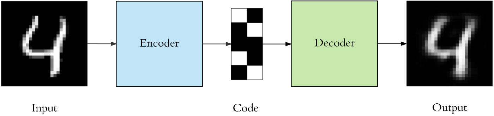

# Image Colorization via AutoEncoders
Colorizing black and white images via the use of AutoEncoders.

## Introduction 

Autoencoders are a specific type of feedforward neural networks where the input is the same as the output. They compress the input into a lower-dimensional code and then reconstruct the output from this representation. The code is a compact “summary” or “compression” of the input, also called the latent-space representation.

An autoencoder consists of 3 components: 
1. *encoder* : compresses the input and produces the code
2. *code* 
3. *decoder* : reconstructs the input only using this code.

To build an autoencoder, we need :
1. Encoding Method
2. Decoding Method
3. Loss Function to compare the outputs with the target

## Architecture

# Application of AutoEncoders in Image Colorization

With the application of AutoEncoders, I am trying to colorize Black and white images, by providing these images as an input and a colored version of these images as a decoded output. The detailed model with implementation can be found [here](ImageColorization_attempt2.ipynb).

## Dataset
The COCO-2017 Dataset's validation directory is used over here in the model due to the system's limited storage capacity.

## Analysis
A training dataset of 3000 images depicted a promising results, with the best ouputs in images regarding nature and animals.
